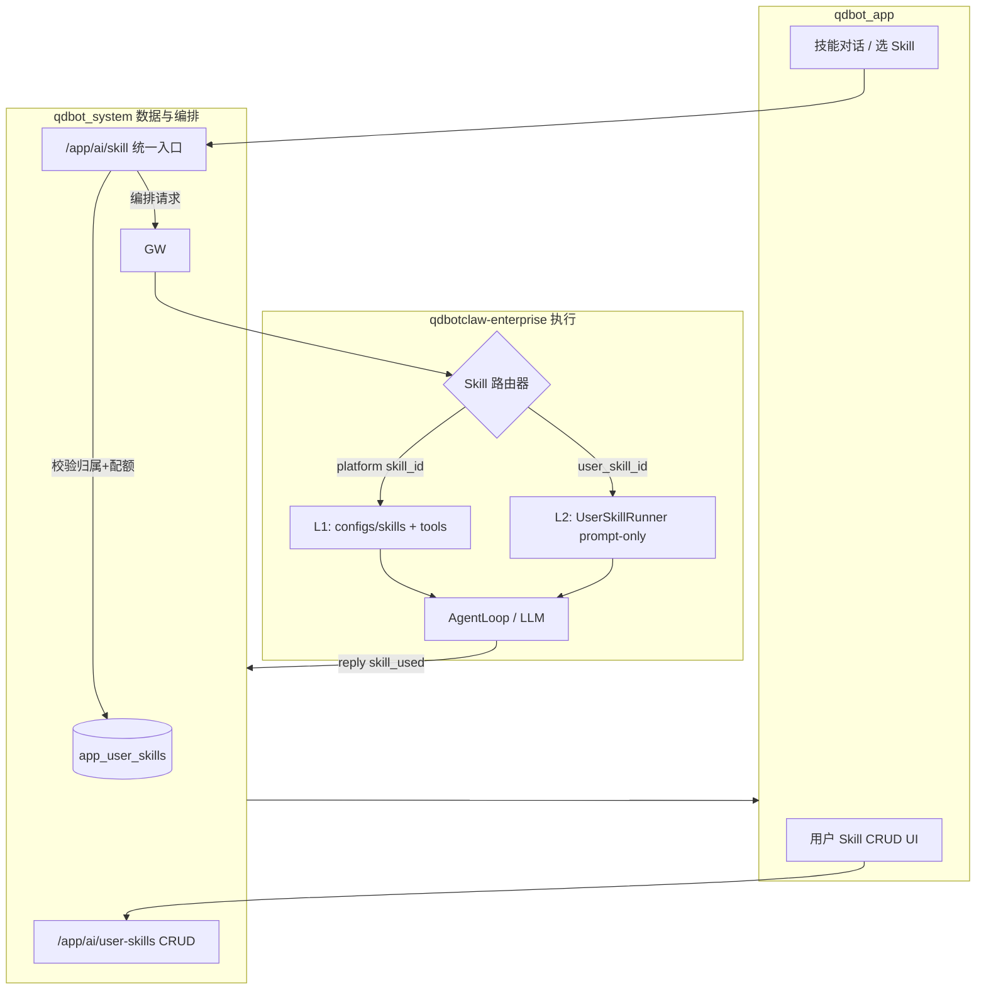

圈子」整体产品设计与微服务架构方案
视角：资深产品经理 + 架构师
参照：微信（社交 + 内容 + 商业闭环）、飞书（组织边界 + 工作台 + 开放生态）
现状：qdbot_app 为 Flutter 客户端；qdbot_system 为远端单体（IM / AI / 用户 / 支付）；webrtc-relay 为首个 sidecar

一、战略定位
1.1 为什么要加「圈子」
当前产品结构是 消息 → 助手 → 我的，偏工具型：

Tab	能力	缺失
消息
1v1 / 群聊 / 通话
公域发现、内容沉淀
助手
AI 对话 / 技能
与真实社交场景割裂
我的
账号 / 支付 / 数字分身
个人品牌与内容出口
圈子 的定位：在「AI 能力」与「个人资产」之间，建立 内容 + 关系 + 商业 的中间层——让用户不只在聊天里存在，也在 可被发现的公域/半公域 里存在。

1.2 与微信 / 飞书的差异策略
维度	微信	飞书	QDBot 圈子（建议）
核心单元
好友关系
组织 / 部门
AI 增强的个人 IP + 兴趣社群
内容形态
朋友圈、视频号
动态、文档流
五圈并列：朋友圈 / 视频圈 / 直播圈 / 购物圈 / 游戏圈
商业
小程序、小店
应用市场
与现有 AI Pro / Premium Code 打通
边界
强隐私、熟人
企业可见性
可见性分级 + 数字分身可代发
差异化一句话：不是复制微信，而是做 「AI 原生的兴趣与交易社区」——内容可 AI 生成/摘要/推荐，IM 一键私聊，数字分身可互动。

二、信息架构（客户端）
2.1 底部导航演进
消息(0) → 助手(1) → 【圈子(2)】 → 我的(3)
圈子 Tab 内部采用 「入口宫格 + 统一 Feed 壳」 双层结构（参考微信「发现」+ 各子模块，飞书「工作台」）：

圈子 Tab
朋友圈
视频圈
直播圈
购物圈
游戏圈
好友/关注动态
短视频推荐流
直播列表 + 直播间
商品流 / 店铺
游戏大厅
顶部：我的圈子入口 / 搜索 / 发布+
五圈入口宫格
默认 Feed 流 / 最近浏览
2.2 五圈产品定义
① 朋友圈（Moments）
参照微信朋友圈 + 飞书动态

能力	MVP	V2
图文动态
✅
多图九宫格
可见范围
公开 / 好友 / 仅自己 / 标签组
企业圈、同城
互动
赞、评论、@
转发到 IM
AI
配文建议、图片摘要
数字分身代点赞/回复草稿
与 IM 打通
点头像 → 私聊 / 名片
动态内嵌 contact_card
不做（初期）：全量公开微博式时间线——避免冷启动噪音。

② 视频圈（Video Circle）
参照微信视频号

能力	MVP	V2
竖屏短视频
✅ 15s–3min
合集、话题
推荐流
关注 + 简单热度
个性化推荐（AI）
互动
赞、评、收藏
弹幕
发布
复用现有 uploadVideoWithPoster
剪辑、配乐
AI
标题/标签生成、内容审核辅助
视频摘要、一键转朋友圈
③ 直播圈（Live Circle）
参照微信直播 + 飞书直播

能力	MVP	V2
开播
语音/视频直播
连麦、PK
观看
HLS 播放 + 聊天室
礼物、预约
基础设施
复用 webrtc-relay + 新增 RTMP/HLS 推流服务
CDN 分发
AI
实时字幕、直播摘要回放
AI 主播（数字分身）
与购物圈
直播间挂商品链接
直播带货闭环
④ 购物圈（Shopping Circle）
参照微信小店 + 飞书应用市场（轻量版）

能力	MVP	V2
商品展示
图文 SKU、店铺主页
多规格、库存
交易
跳转 H5 / 对接现有 PayApi
原生下单、物流
来源
用户 / 认证商家 / AI 推荐清单
直播带货、朋友圈种草
AI
「帮我选」对话式导购
比价、评价摘要
合规
实名商家、类目白名单
资质审核后台
⑤ 游戏圈（Game Circle）
参照微信小游戏

能力	MVP	V2
形态
H5 / WebView 小游戏大厅
原生 SDK
账号
SSO（现有 token）
排行榜、好友 PK
分发
圈子内推荐位
直播/购物联动活动
商业
广告 / 道具内购（接支付）
开放平台
MVP 建议：游戏圈先做 「游戏入口聚合 + 统一账号」，不自研游戏引擎。

三、用户与关系模型
圈子需要独立于 IM 群聊的 社交图谱：

USER
PK
string
user_id
string
user_code
int
level
FOLLOW
string
from_user
string
to_user
string
source
FRIEND
(no attributes)
POST
PK
string
post_id
string
circle_type
string
visibility
json
content
SHOP
(no attributes)
COMMENT
(no attributes)
REACTION
(no attributes)
LIVE_ROOM
(no attributes)
LIVE_MSG
(no attributes)
SKU
(no attributes)
follows
mutual
publishes
owns
has
has
has
has
关系策略（产品规则）

关注 ≠ IM 好友：可单向关注（视频圈），互关才可看部分朋友圈（类微信）。
Premium Code / 数字分身：可在圈子展示，点击跳转 IM 或 AI 对话。
组织圈（飞书式，V2）：企业成员可见动态，与现有用户体系扩展 org_id。
四、微服务总体架构
4.1 原则
渐进式拆分：qdbot_system 保留 auth / 用户基础；新域独立服务，避免单体继续膨胀。
BFF 统一入口：客户端仍只连 https://www.aimatchem.com，由 API Gateway 路由。
事件驱动：圈子写操作发 Kafka/NATS 事件，IM 通知、AI 索引、搜索异步消费。
媒体与实时分离：上传走对象存储；直播/WebRTC 走专用 relay（已有 webrtc-relay 可演进）。
4.2 服务全景
API Gateway (nginx + auth middleware)
核心域（现有 + 演进）
圈子域（新建）
实时域
数据与搜索
events
events
events
Flutter App / Web
/app/*
qdbot-auth
qdbot-user
qdbot-im
qdbot-ai
qdbot-pay
qdbot-notify
qdbot-upload / MinIO
qdbot-circle-core
qdbot-circle-feed
qdbot-circle-media
qdbot-circle-live
qdbot-circle-shop
qdbot-circle-game
qdbot-ws-hub
webrtc-relay
live-ingest / SRS
PostgreSQL
Redis
OpenSearch
MinIO/S3
4.3 服务职责边界
服务	职责	存储	对外 API 前缀
qdbot-circle-core
发帖、评论、赞、关注、可见性、举报
PostgreSQL
/app/circle/v1/
qdbot-circle-feed
Timeline 聚合、推荐、已读、热度
Redis + OpenSearch
/app/circle/v1/feed/
qdbot-circle-media
短视频元数据、转码任务、封面
OSS + PG
/app/circle/v1/video/
qdbot-circle-live
直播间 CRUD、开播/停播、聊天室
PG + Redis
/app/circle/v1/live/
live-ingest (SRS)
RTMP/WebRTC 收流 → HLS
本地/边缘
内部
qdbot-circle-shop
店铺、SKU、订单、购物车
PG
/app/circle/v1/shop/
qdbot-circle-game
游戏目录、会话、排行榜
PG + Redis
/app/circle/v1/game/
qdbot-ws-hub
统一 WS：IM + 圈子事件推送
Redis PubSub
/ws/app/connect
qdbot-ai（现有）
配文、摘要、审核、导购对话
—
/app/ai/*
qdbot-im（现有）
私聊、群、通话信令
—
/app/im/*
关键边界

Core 管写，Feed 管读：发帖写 Core，Feed 服务订阅 post.created 更新 Timeline（微信朋友圈经典读写分离）。
Media 不管支付，Shop 不管转码：避免跨域事务。
Live 聊天 可走 IM 群通道或独立 room channel（MVP 用 Redis Stream 即可）。
五、核心流程设计
5.1 发朋友圈
上传图片
url
POST /circle/v1/posts {type:moment, content, visibility}
校验 token + 可见性
落库 post
event post.created
fan-out 到粉丝 timeline (Redis)
push circle.moment.new
粉丝端刷新
可选 @某人 → IM 系统通知
App
Gateway
circle-core
Upload
circle-feed
ws-hub
im-notify
5.2 短视频推荐流
客户端请求 GET /circle/v1/feed/video?cursor=
Feed 服务 合并：关注链 + 热度池 +（V2）AI 个性化分
播放行为上报 POST /circle/v1/video/events（完播、点赞）→ 反哺推荐
5.3 直播
POST /live/rooms {title}
room_id, push_url, play_url
WebRTC/RTMP 推流
HLS 切片
GET /live/rooms/{id}
拉 HLS
WS 聊天 / 点赞
主播 App
circle-live
SRS/live-ingest
CDN
观众 App
与现有资产复用：TURN/ICE 仍走 webrtc-relay；直播信令可扩展 call_signal 模式或独立 live_signal。

5.4 购物闭环
种草（朋友圈/视频） → 商品详情 → 下单（circle-shop） → 支付（qdbot-pay） → 订单通知（notify + IM）
AI 导购：POST /app/ai/skill + skillHint: shop_guide，上下文带 SKU JSON。

5.5 游戏圈
MVP：Catalog 服务 返回 {gameId, name, icon, h5Url, category}，App WebView 打开，postMessage 回传分数。
V2：OAuth2 式 game_token 短令牌，隔离游戏侧权限。

六、API 与事件契约（摘要）
6.1 REST 示例
POST   /app/circle/v1/posts              # 统一发帖（type: moment|video|shop_note）
GET    /app/circle/v1/feed/moments       # 朋友圈流
GET    /app/circle/v1/feed/video         # 视频圈推荐
POST   /app/circle/v1/follow/{userId}
POST   /app/circle/v1/live/rooms
POST   /app/circle/v1/live/rooms/{id}/start
GET    /app/circle/v1/shop/skus
POST   /app/circle/v1/shop/orders
GET    /app/circle/v1/games
统一响应：{ code, data, cursor, hasMore }（与现有 IM API 风格一致）。

6.2 WS 事件扩展
在现有 WS 上增加 domain: circle：

{
  "type": "circle",
  "event": "moment.new | video.like | live.start | order.paid",
  "payload": { "postId": "...", "fromUserId": "..." }
}
客户端 home_page.dart 需扩展：circle 事件 → Tab index 2 + 未读角标。

6.3 领域事件（服务间）
Event	Producer	Consumers
post.created
circle-core
circle-feed, qdbot-ai(index), notify
video.transcoded
circle-media
circle-feed, notify
live.started
circle-live
notify, circle-feed
order.paid
circle-shop
pay, im, notify
user.followed
circle-core
notify, feed
消息总线：NATS JetStream（轻量）或 Kafka（量大后迁移）。

七、数据与性能
7.1 朋友圈 Timeline（fan-out）
方案	适用
写扩散（发帖时写入每个粉丝 Redis ZSET）
普通用户粉丝 < 5k
读扩散（拉取时合并关注链）
大 V、降级策略
混合
粉丝 > 5k 走读扩散 + 热门缓存
Redis Key 示例：timeline:{userId} → ZSET(postId, score=timestamp)

7.2 视频与直播
短视频：上传 → 异步转码（720p/1080p）→ 封面帧（已有 video_poster 逻辑可服务端化）
直播：SRS + HLS，MVP 单节点；量大后 CDN 回源
7.3 搜索
OpenSearch 索引：posts, users, skus, live_rooms
与 AI：检索结果 + LLM 重排（「帮我找上周谁发了某某产品」）

八、安全、合规与治理
项	方案
内容审核
发帖异步机审（文本+图片+视频帧）+ 人工后台
可见性
服务端强制校验，客户端仅 UI 展示
直播
实名开播、举报、断流 API
电商
商家资质、类目限制、交易留痕
游戏
版号/适龄提示（国内合规）
反爬
Gateway 限流 + 设备指纹（Web）
隐私
导出/删除联动 user 服务 GDPR 式删除
九、Flutter 客户端改造要点
9.1 目录建议
lib/
  ui/circle/
    circle_tab.dart           # 圈子首页（宫格 + 默认流）
    moments/                  # 朋友圈
    video/                    # 视频圈
    live/                     # 直播圈
    shop/                     # 购物圈
    game/                     # 游戏圈
  api/circle_api.dart
  api/circle_feed_api.dart
  api/circle_shop_api.dart
9.2 复用现有能力
已有	复用于
UploadApi
图片/视频/商品图
MediaAttachment / 波形 / 视频封面
视频圈、直播回放
ContactCard
圈子个人主页 → 加好友/私聊
AiApi.sendSkill
配文、摘要、导购、审核辅助
NotifyInbox
圈子互动通知
PayApi
购物圈、直播礼物（V2）
webrtc-relay
直播连麦、语音直播
9.3 导航改造清单
HomePage：4 Tab，IndexedStack 增加 CircleTab
WS 路由：circle.* → index 2
subscription 跳转：index 2 → 3（我的）
角标：圈子未读（赞/评/直播开播/订单）
十、分阶段路线图
Phase 0 — 基座（4–6 周）

 API Gateway 路由 /app/circle/*

 qdbot-circle-core + qdbot-circle-feed

 Flutter：圈子 Tab 壳 + 朋友圈 MVP

 WS circle 事件 + 通知

 关注关系 + 可见性三档（公开/好友/私密）
验收：可发帖、刷好友圈、点赞评论、点头像进 IM。

Phase 1 — 视频圈（4 周）

 qdbot-circle-media + 转码队列

 竖屏 Feed + 发布（复用现有视频上传）

 AI 标题/标签
Phase 2 — 直播圈（6 周）

 SRS + qdbot-circle-live

 开播/观看/聊天室

 直播回放 → 视频圈
Phase 3 — 购物圈（6 周）

 qdbot-circle-shop + 接 PayApi

 店铺、SKU、订单

 朋友圈/视频/直播挂链
Phase 4 — 游戏圈（4 周）

 游戏目录 + H5 容器 + 统一登录

 排行榜、活动运营位
Phase 5 — 智能化与开放

 AI 推荐流、数字分身代运营

 开放平台（第三方店铺/游戏接入）

 组织圈（飞书式 B2B）
十一、团队与部署
11.1 服务部署（与现网一致）
www.aimatchem.com (nginx)
  /app/im/*      → qdbot-im (现有)
  /app/ai/*      → qdbot-ai (现有)
  /app/circle/*  → circle-* 服务（新 upstream）
  /webrtc/       → webrtc-relay (现有)
  /live/         → SRS HLS (新)
  /ws/           → ws-hub
每个 circle 微服务：独立 repo 或 mono-repo 子目录 + 独立 systemd/docker + 独立 DB schema。

11.2 建议编制
角色	人数	负责
产品
1
五圈优先级、合规、运营
后端
2–3
core/feed/media/live/shop
客户端
1–2
Flutter 圈子 Tab + 五圈 UI
流媒体
1
SRS/CDN/直播（Phase 2 起）
算法/AI
0.5
推荐、审核、导购
十二、风险与决策建议
风险	缓解
单体 qdbot_system 继续膨胀
圈子 必须新服务，仅 auth/user 走共享
冷启动无内容
官方账号 seed + AI 生成示范圈 + Premium 用户优先入驻
直播成本高
Phase 2 前不做；MVP 可「预约 + 录播假直播」过渡
电商合规
Phase 3 前完成商家审核流程，不做 C2C 随意卖货
客户端 Tab 过多
圈子内宫格聚合，底部仍 4 Tab
与 IM 重复
群聊 = 实时协作；圈子 = 异步内容+公域发现，边界文档化
十三、结论
产品层：在「助手」与「我的」之间插入 圈子，用五圈承载 社交内容 → 实时互动 → 交易 → 娱乐 的完整链路，并以 AI + 数字分身 + IM 作为差异化，而非单纯复制微信。

架构层：采用 Gateway + 圈子域微服务（core / feed / media / live / shop / game）+ 事件总线 + 统一 WS，与现有 qdbot-im、qdbot-ai、webrtc-relay、MinIO、支付体系 组合演进，分 5 个 Phase 落地，优先 朋友圈 → 视频圈，直播与电商按合规与资源就绪后再开。

---

## Phase 0 实施进度（2026-07-03）

| 项 | 状态 | 说明 |
|----|------|------|
| Gateway `/app/circle/*` | ✅ | nginx → `qdbot_circle:8100` |
| `qdbot-circle-core` | ✅ | 独立 repo `qdbot_circle`，SQLite |
| `qdbot-circle-feed` | ⏸ | 读写在 core 内，未拆服务 |
| Flutter 圈子 Tab + 五圈宫格 | ✅ | 朋友圈/视频圈已开放 |
| 朋友圈 MVP | ✅ | 发帖/Feed/赞评/可见性/关注 |
| 点头像 → IM | ✅ | `circle_author_sheet.dart` |
| WS `type=circle` | ✅ | circle → system internal push → 客户端 |
| 可见性三档 | ✅ | public / friends / private |

**架构约定**：业务在 `qdbot_circle`；WS 推送借 `qdbot_system` `POST /app/internal/circle/push`（`CIRCLE_INTERNAL_KEY` 两端一致）。

**下一步 Phase 1**：`qdbot-circle-media`、竖屏视频 Feed、复用 UploadApi。

## Phase 1 实施进度（2026-07-03）

| 项 | 状态 | 说明 |
|----|------|------|
| 视频发帖 API（`circleType: video`） | ✅ | `videoUrl` / `posterUrl` 字段 |
| `GET /feed/video` | ✅ | 与朋友圈相同可见性规则 |
| WS `video.new` | ✅ | 推送给粉丝 |
| Flutter 视频圈 Tab | ✅ | 竖屏 PageView + 发布页 |
| AI 标题 / 配文 | ✅ | Flutter `circle_ai.dart` → `/app/ai/skill` |
| 服务端转码 | ⏸ | 未做；需要时再建 media 服务 |

**Phase 2（直播圈）**：进行中 — SRS + 房间 CRUD + HLS 观看 + 聊天室 + OBS 推流。

## Phase 2 实施进度（2026-07-03）

| 项 | 状态 | 说明 |
|----|------|------|
| SRS 推流/HLS | ✅ | `qdbot_srs`（1935 RTMP / 8180 HLS），nginx `/live/` |
| 直播间 API | ✅ | `POST/GET /v1/live/rooms`，start/stop，messages |
| WS `live.start` | ✅ | 开播通知粉丝 |
| Flutter 直播圈 | ✅ | 列表 / 观看(HLS) / 开播(OBS 推流) / 聊天 |
| 用户圈子页 | ✅ | `GET /users/{id}/posts`；点头像进 TA 的圈子 |
| 生产部署 | ✅ | SRS 镜像走阿里云 `registry.cn-hangzhou.aliyuncs.com/ossrs/srs:5` |
| App 内推流 | ⏸ | 需 WebRTC/WHIP，后续再做 |
| 直播回放 → 视频圈 | ✅ | 停播时 `archiveLiveReplay` 写入视频圈（需 SRS DVR + `srs.conf` 挂载） |

**开播验证（OBS）**
1. 圈子 → 直播圈 → 我要开播 → 创建并「开始直播」
2. OBS：服务器 `rtmp://39.96.167.94:1935/live`，串流密钥填 API 返回的 `roomId`
3. 粉丝在直播圈列表进入观看；HLS 地址 `https://www.aimatchem.com/live/{roomId}.m3u8`

下面从**产品经理 + 资深架构师**视角，把你提出的「两层 Skill」放到现有代码栈里对齐，并给出是否应在 `qdbot_system` 存用户专有 Skill、以及何时走哪一层的建议。

---

## 1. 两层 Skill 的产品定义（先统一语言）

| 层级 | 名称 | 谁定义 | 典型例子 | 今天代码里在哪 |
|------|------|--------|----------|----------------|
| **L1 平台 Skill** | 智能体/企业 Skill | 平台/租户运营/研发 | `lfp`、`researcher`、`summarize`、工具链、RAG、多步 Agent | `qdbotclaw-enterprise/configs/skills/*/SKILL.md` + `POST /api/v1/skills/{id}/execute` + AgentLoop 自动路由 |
| **L2 用户 Skill** | 专有技术 Skill | **终端用户**在 App 里自定义 | 「我的 LFP 涂布工艺问答」 | `qdbot_system` `app_user_skills` + App「我的 → 专有 Skill」+ enterprise `ChatUserSkill` |

**产品边界**：

- **L1** = 平台能力、可审计、可版本、可带工具/RAG/高风险操作（enterprise 已有 draft/review/tenant config）。
- **L2** = 用户私有知识 + 私有 prompt 模板，**不应**要求用户写 `SKILL.md` 或部署到 gateway 磁盘。

你的方向（App 定义 → system 落库 → enterprise 执行 → 回 App）**合理**，且与现有 L1 不冲突，关键是**命名空间 + 路由规则**要设计清楚。

---

## 2. 现有实现 vs 你的设想（差距）

**已有（L1）**

- Enterprise：`/api/v1/skills/{id}/execute`，`ContextWithSkill(id)` 预选技能，走 AgentLoop。
- Enterprise：租户级 `/tenants/{tenant_id}/skills/{skill_id}/config`（运营配置，不是用户 CRUD）。
- System：`/app/ai/skill` + `user_skill_id` → L2 meta 入队；`skill_hint` 仍兼容但 **App 助手已不用**。
- App：助手仅 **自由对话**（`/send`）+ **专有 Skill**（图标选择 L2）；无 L1 chip。

**已有（L2）**

- System：`app_user_skills` CRUD、`[[qdbot_meta]]` 入队。
- Enterprise：`ChatUserSkill` 纯 LLM；session `usk:{skillId}:{convId}`。
- App：专有 Skill 管理页 + 助手输入框左侧图标切换。

**仍可选清理（非阻塞）**

- System/enterprise 的 `applySkillHint` / `skill_hint` 路径（仅旧客户端或运维脚本）。

---

## 3. 推荐总体架构（职责划分）



**原则**：

| 组件 | 职责 |
|------|------|
| **qdbot_app** | 创建/编辑/启用用户 Skill；技能对话里**显式选择**某个用户 Skill |
| **qdbot_system** | **L2 唯一数据源**（CRUD、归属、版本、审计、配额）；编排发往 gateway；**不在 system 里跑 LLM** |
| **qdbotclaw-enterprise** | **唯一 LLM/Agent 执行面**；L1 走现有 Skill 管线；L2 走「用户 Skill 执行器」（prompt 注入，默认无危险工具） |

**是否存 qdbot_system 数据库？——建议：是。**

理由：

1. 用户数据天然属于 App 域，已有 JWT、租户、配额（`app_ai_skill_daily`）都在 system。
2. Enterprise 应保持**无状态执行**（或短缓存），避免每个 gateway 节点各存一份用户 Skill。
3. 与 L1 的「磁盘 + 运营发布流程」分离，避免用户内容污染 `configs/skills/`。

---

## 4. 什么情况触发 L1，什么情况触发 L2

### 4.1 决策树（建议写进产品 spec）

```
用户发起一次 AI 请求
│
├─ 会话类型 = 「新对话」（自由聊天）
│   └─ 默认：L0 通用 AgentLoop（无固定 Skill）
│       └─ 可能由 L1 自动路由（intent/skill_lane 选中 lfp、researcher 等）
│
├─ 会话类型 = 「技能对话」
│   │
│   ├─ 用户显式选了「我的专有 Skill X」
│   │   └─ **强制 L2**：user_skill_id = X
│   │
│   ├─ 用户点了 App 内置快捷 chip（摘要/翻译/邮件）
│   │   ├─ 若用户为该 chip 绑定了默认 L2 Skill → L2
│   │   └─ 否则 → **L1**（enterprise summarize/email 等）或 L1 execute + hint
│   │
│   └─ 用户未选 Skill，直接输入
│       ├─ 若仅 1 个启用中的用户 Skill 且开启「默认专有」→ L2
│       └─ 否则 → L1 自动路由 或 通用 Agent（产品可配置）
│
└─ 外部通道（微信/QQ，经 deliveryQueue + WS）
    └─ 默认 L1（平台 Skill + 租户配置）
    └─ 仅当 message 带 user_skill_id（Deep link / 小程序参数）→ L2
```

### 4.2 场景对照表

| 场景 | 触发层 | 原因 |
|------|--------|------|
| 用户点「写摘要」且未建专有 Skill | **L1** `summarize` 或 Agent 自动选 Skill | 平台标准能力，质量/工具统一 |
| 用户点「我的质检问答」专有 Skill | **L2** | 用户私有 prompt/知识，平台 Skill 不应包含 |
| 新对话问「磷酸铁锂烧结温度」 | **L1**（可能路由到 `lfp`） | 开放域 + 平台领域 Skill |
| 技能对话里选了「个人 SOP Skill」再问细节 | **L2** | 用户显式 intent |
| 圈子 AI 配文，用户有「我的朋友圈风格」Skill | **L2**（推荐） | 个性化内容，适合用户 Skill |
| 圈子配文，无用户 Skill | **L1** 或轻量 prompt | 与 today `circle_ai.dart` 的 summarize hint 类似 |
| Cron/运维告警 | **L1** | 系统任务，非用户 Skill |
| 用户 Skill 需要调外部 HTTP API | **L2 扩展**：在 system 存 API 元数据，enterprise 用受控 executor（类似 L1 `skill_http_executor`） | 需单独安全评审 |

### 4.3 PM 建议：UI 上不要让两层「看起来一样」

- **平台能力**：chip 带平台标识（⚡ 平台技能）。
- **我的专有 Skill**：独立 Tab/列表，必选或默认一项，避免用户以为「技能对话」全是平台能力。
- **反馈**：`skill_used` 返回 `layer: platform | user` + `skill_id`，便于解释「为什么这次走了平台/专有」。

---

## 5. 数据模型（system 侧，最小可行）

```sql
-- 概念表，非现网已有
app_user_skills (
  skill_id        TEXT PRIMARY KEY,  -- 建议: usk_{userId}_{shortId}
  user_id         TEXT NOT NULL,
  tenant_id       TEXT NOT NULL,
  name            TEXT NOT NULL,     -- 「LFP 工艺问答」
  description     TEXT,
  system_prompt   TEXT NOT NULL,     -- 专有技术指令（核心）
  user_prompt_tpl TEXT,              -- 可选：{{input}} 模板
  constraints     JSONB,             -- 输出格式、长度、禁止项
  examples        JSONB,             -- few-shot
  status          TEXT,              -- draft | active | archived
  version         INT,
  created_at, updated_at
)
```

**skill_id 命名空间**（避免与 L1 冲突）：

- L1：`lfp`、`researcher`（filesystem）
- L2：`usk_xxx` 或 URI 形式 `user://{userId}/{skillId}`

Enterprise 路由：**若 id 以 `usk_` 开头 → L2，否则 → L1 文件 Skill**。

---

## 6. 调用链设计（system ↔ enterprise）

### 6.1 推荐：system **编排 + 快照推送**（首版）

`POST /app/ai/skill` 扩展 body：

```json
{
  "message": "用户问题",
  "user_skill_id": "usk_abc123",
  "session_key": "skill_user123"
}
```

`qdbot_system` 流程：

1. 校验 JWT + `user_skill` 归属 + 配额  
2. 从 DB 读取 **active 版本**（可内联 snapshot）  
3. 调 enterprise（二选一）：

| 方式 | 路径 | 适用 |
|------|------|------|
| **A. 专用 execute** | `POST /api/v1/user-skills/execute`（enterprise 新增） | 语义清晰 |
| **B. 复用 agent/chat** | `POST /api/v1/agent/chat` + `structured_input.user_skill` | 改动最小 |

请求示例（B）：

```json
{
  "tenant_id": "...",
  "user_id": "...",
  "session_key": "skill_...",
  "message": "用户原文",
  "structured_input": {
    "skill_layer": "user",
    "user_skill": {
      "id": "usk_abc",
      "name": "...",
      "system_prompt": "...",
      "constraints": {}
    }
  }
}
```

Enterprise **L2 执行器**（新概念，非现网）：

- 不加载 `configs/skills/usk_abc/SKILL.md`
- 将 `system_prompt + constraints + message` 拼成 **单轮/多轮 LLM**（默认 **不开放** L1 全套 tools，或仅 `read_file` 等白名单）
- 返回 `reply` + `skill_used: "usk_abc"` + `skill_layer: "user"`

### 6.2 备选：enterprise **回拉** system（大 Skill / 高版本一致性）

```
enterprise 收到 user_skill_id
  → GET /internal/v1/user-skills/{id}  (service key + user_id)
  → 执行
```

适合：prompt 很长、多版本、需 enterprise 侧缓存。首版可 **push snapshot**（`version` + hash），减少往返。

**不建议**：enterprise 直连 system DB。

---

## 7. L1 与 L2 在 enterprise 内的分工（架构）

| 维度 | L1 平台 Skill | L2 用户 Skill |
|------|---------------|---------------|
| 存储 | `configs/skills/` + tenant config | **qdbot_system DB** |
| 触发 | intent 路由、`/skills/{id}/execute`、tool `skill_api_call` | App 显式 `user_skill_id` |
| 工具/RAG | 可全开（按 SKILL.md policy） | **默认仅 LLM**；进阶再申请 tool 白名单 |
| 发布 | draft/review/rollback（已有） | 用户 save → active（可可选「分享/审核」） |
| 配额 | 租户 LLM quota | system `ConsumeSkillQuota` + enterprise quota |
| 审计 | enterprise delivery audit | system 记「谁用了哪个 user_skill」 |

**何时仍走 L1（即使在做技能对话）**：

- 用户选的是平台 chip，且**没有**对应 L2 绑定。  
- 请求里**没有** `user_skill_id`，且产品策略是「交给 Agent 自动选平台 Skill」。  
- 用户 Skill 被禁用/删除 → fallback L1 或明确错误（建议 **不要 silent fallback**，避免答非所问）。

**何时必须 L2**：

- 用户显式选择「我的专有 Skill」。  
- 业务要求**答案仅来自用户 prompt/知识**（合规、IP 隔离）→ 必须 L2，且 L2 runner **禁止**自动切到 L1 的 `lfp` 等。

---

## 8. 与现有代码的衔接（避免重复建设）

1. **废弃 system 侧 `applySkillHint` + `localSkillReply` 作为正式能力**  
   → 生产只作 `AI_DEMO_MODE`；真实环境统一走 gateway。

2. **App chip 演进**  
   - 固定 chip → 映射到 L1 skill_id（`summarize` → enterprise `summarize`）  
   - 用户 Skill 列表 → 动态 chip，`user_skill_id` 必填。

3. **复用 enterprise 已有能力**  
   - L1：继续 `executeSkillHandler` + `ContextWithSkill`  
   - L2：新增薄层 `UserSkillRunner`，内部仍用 `AgentLoop` 或 **轻量 LLM caller**（无 tool loop，成本低）

4. **圈子 AI**（`circle_ai.dart`）  
   - 若用户有「配文风格」L2 → 传 `user_skill_id`  
   - 否则 L1 `summarize` 或通用 chat

---

## 9. 分阶段落地（产品 + 工程）

| 阶段 | 交付 | 价值 |
|------|------|------|
| **P0** | system 表 + CRUD API + App 列表/编辑；`/app/ai/skill` 带 `user_skill_id`；enterprise `structured_input.user_skill` 执行 | 专有 Skill 闭环 |
| **P1** | `skill_used` / `skill_layer` 回传；平台 chip 映射 L1；去掉 prod mock | 两层可观测、可解释 |
| **P2** | 用户 Skill 版本、导入导出、默认 Skill；internal pull API | 运营与重度用户 |
| **P3** | L2 可选绑定只读 RAG/HTTP（审批制） | 专有 + 检索，仍隔离 L1 工具 |

---

## 10. 直接回答你的核心问题

> 是否考虑在 qdbot_app 定义专有 Skill，存 qdbot_system，enterprise 收到指令后从 system 取 Skill 再 LLM 反馈？

**是，推荐这样做**，并补充三点：

1. **存 system、执行 enterprise** — 数据在 system，算力在 enterprise，职责清晰。  
2. **触发规则** — **显式 `user_skill_id` → L2**；**平台 chip / 自动 intent / 外部通道默认 → L1**；自由「新对话」→ 通用 Agent，可能间接用到 L1。  
3. **首版不必 enterprise 实现完整「用户 Skill 文件系统」** — L2 以 **DB 中的 prompt 包 + 受限 LLM** 即可；与 L1 的 `SKILL.md + tools` 区分开。

若你认可这个分层，下一步可以在 `docs/` 写一页 **ADR：Two-Layer Skill Model**，并列出 P0 的表结构 + `/app/ai/user-skills` + enterprise `user_skill` 执行契约。需要的话我可以直接起草 ADR 和 API 草案。